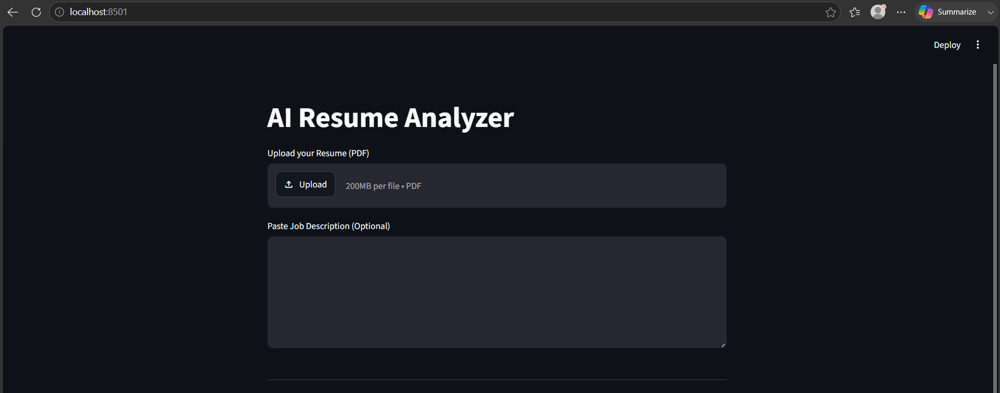
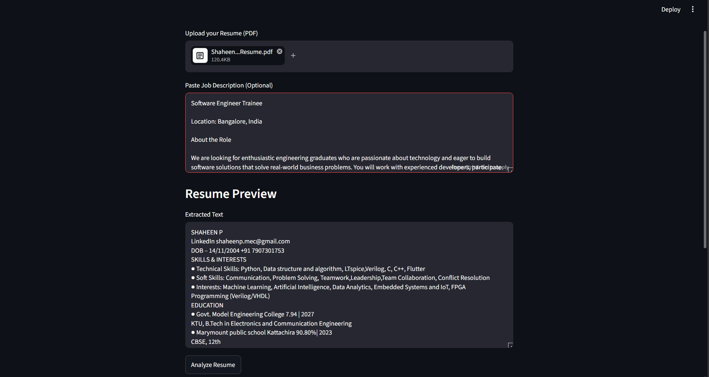
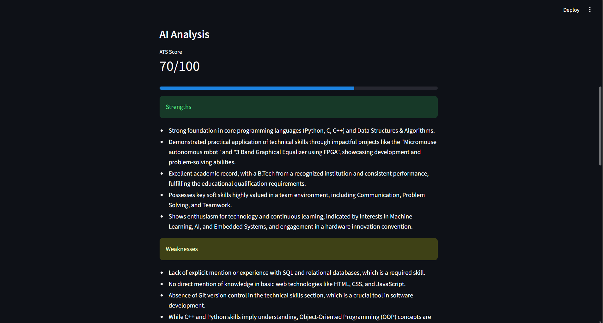
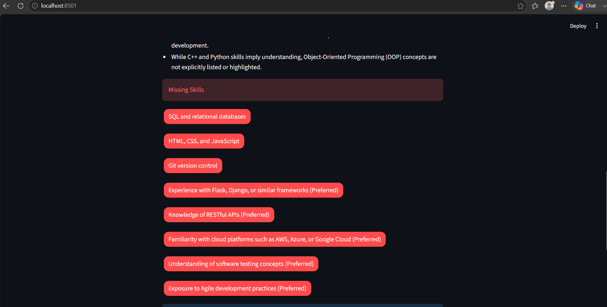
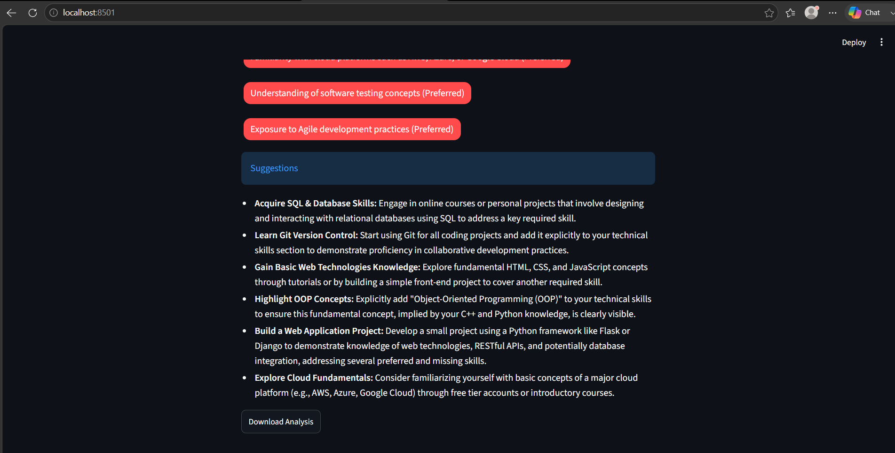
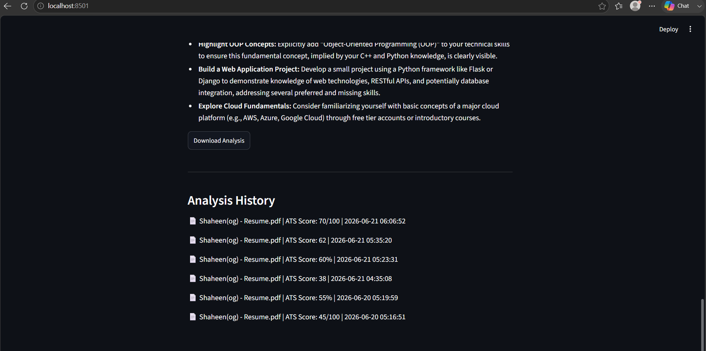

# AI Resume Analyzer

An AI-powered Resume Analyzer built using Python, Streamlit, Google Gemini API, PDFPlumber, and SQLite.

The application allows users to upload resumes, extract text from PDF files, analyze resumes using AI, compare resumes against job descriptions, identify missing skills, track analysis history, and download feedback reports.

---

## Features

✅ Upload Resume PDF

✅ Extract Resume Text

✅ AI-Powered Resume Analysis using Gemini

✅ ATS Score Generation

✅ Resume Strengths Detection

✅ Resume Weakness Detection

✅ Improvement Suggestions

✅ Job Description Matching

✅ Missing Skills Detection

✅ Analysis History using SQLite Database

✅ Download Analysis Report

✅ Clean Streamlit User Interface

---

## Tech Stack

- Python
- Streamlit
- Google Gemini API
- PDFPlumber
- SQLite
- Git & GitHub

---

## Installation

Clone the repository:

```bash
git clone https://github.com/shaheen-basheer/AI-Resume-Analyzer.git
```

Move into project folder:

```bash
cd AI-Resume-Analyzer
```

Install dependencies:

```bash
pip install -r requirements.txt
```

Add your Gemini API key inside:

```text
gemini_key.txt
```

Run the application:

```bash
streamlit run app.py
```

---

## Project Structure

```text
AI_Resume_Analyzer/
│
├── app.py
├── database.py
├── requirements.txt
├── README.md
├── gemini_key.txt
├── resume_history.db
│
└── screenshots/
    ├── home.png
    ├── upload.png
    ├── analysis1.png
    ├── analysisimage2.png
    ├── analysisimage3.png
    └── history.png
```

---

## Screenshots

### Home Page



### Resume Upload



### AI Analysis - ATS Score , strength and weeknesses



### AI Analysis -  Missing Skills



### AI Analysis - Suggestions



### Analysis History



---

## Future Improvements

- Multi-resume comparison
- Resume ranking
- Better ATS scoring algorithm
- Export report as PDF
- User authentication
- Cloud database integration

---

## Author

Shaheen Basheer

GitHub:
https://github.com/shaheen-basheer